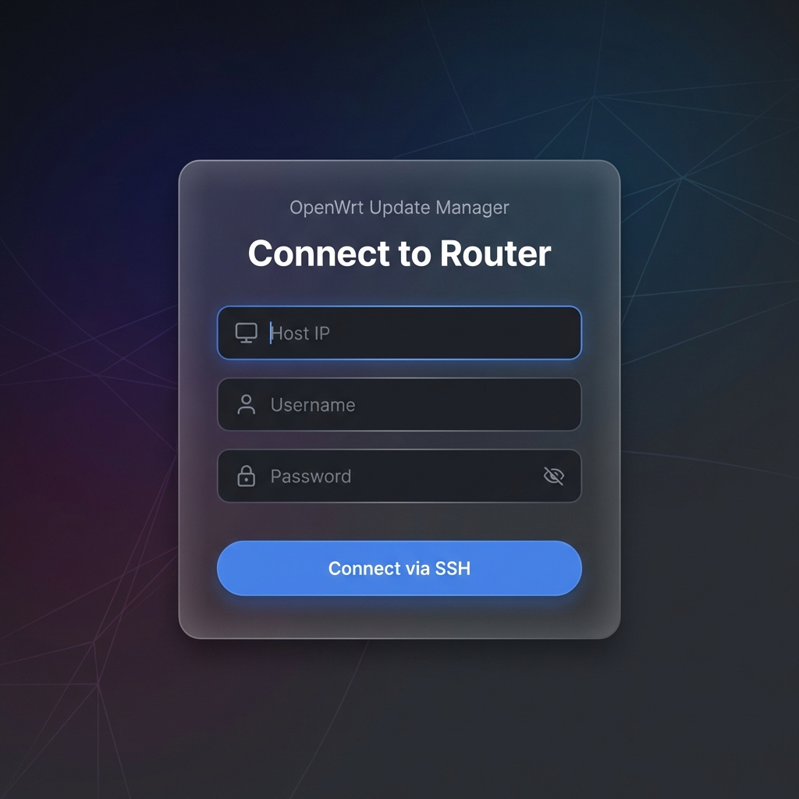
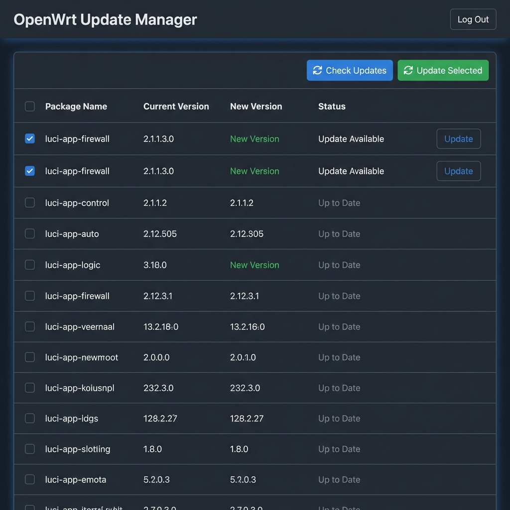

# OpenWrt Update Manager (OUM)

A web-based tool to manage OpenWrt package updates. This application allows you to connect to your OpenWrt router via SSH, view installed packages, check for updates, and perform upgrades directly from a modern dashboard.

## Features

-   **SSH Connection**: Securely connect to your router using IP, username, and password.
-   **Package Monitoring**: View a list of all installed packages.
-   **Update Checking**: Automatically check for available upgrades.
-   **Batch Upgrades**: Select multiple packages and upgrade them in one go.
-   **Dockerized**: Easy deployment using Docker.

## Screenshots

### Login Screen


### Dashboard


## Docker Deployment (Recommended)

The application is fully Dockerized and available on Docker Hub.

### Prerequisites

-   Docker and Docker Compose installed on your machine.

### Quick Start

1.  Clone this repository or download the `docker-compose.yml` file.
2.  Run the following command in the directory containing `docker-compose.yml`:

    ```bash
    docker compose up
    ```

3.  Access the application:
    -   **Frontend**: [http://localhost:8833](http://localhost:8833) (or `http://<YOUR_LAN_IP>:8833` from other devices)
    -   **Backend**: Internal port 3300 (dynamically accessed by frontend)

### Using Docker Hub Images Directly

You can also pull the images directly from Docker Hub:

```bash
docker pull hacksmith/oum-backend:latest
docker pull hacksmith/oum-frontend:latest
```

## Manual Development Setup

If you prefer to run the application locally without Docker, follow these steps.

### Prerequisites

-   **Node.js**: Version 18 or higher (v20 Recommended).
-   **npm**: Included with Node.js.
-   **SSH Access**: Access to an OpenWrt router with SSH enabled.

### 1. Backend Setup

The backend connects to your OpenWrt router via SSH and exposes a REST API.

1.  Open a terminal and navigate to the `backend` directory:
    ```bash
    cd backend
    ```

2.  Install the required dependencies:
    ```bash
    npm install
    ```

3.  Start the development server:
    ```bash
    npm run dev
    ```
    -   You should see: `Backend running on http://localhost:3001`
    -   The server will automatically restart if you make changes (powered by `nodemon`).

### 2. Frontend Setup

The frontend is a React application built with Vite.

1.  Open a **new** terminal window and navigate to the `frontend` directory:
    ```bash
    cd frontend
    ```

2.  Install dependencies:
    ```bash
    npm install
    ```

3.  Start the development server:
    ```bash
    npm run dev
    ```
    -   Vite will start the server, usually at `http://localhost:5173`.
    -   Open this URL in your browser to use the application.

### Important Notes

-   Ensure the **Backend** is running before trying to log in from the Frontend.
-   The Frontend is configured to proxy API requests to `http://localhost:3001` (ensure `vite.config.ts` or API base URL in `src/api.ts` points to the correct backend URL if you change ports).
